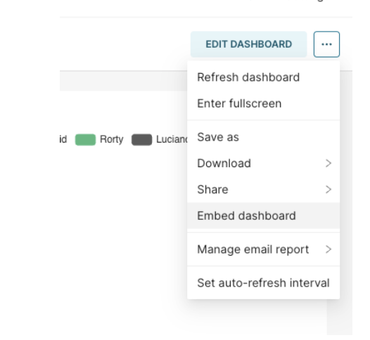
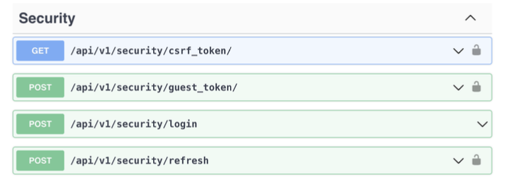

test

# Superset Restack repository

Welcome to the Superset Restack Starter Repository! This repository serves as a template for building your own Apache Superset using Restack.

## About Restack

[Restack](https://www.restack.io/) is the platform to run your favorite open source products: Build your custom image, scale cost-efficiently with no downtime and upgrade seamlessly to the latest release.

## Features

This starter repository includes:

- A pre-configured Dockerfile for building a Superset image tailored for Restack deployments.
- A pre-configured superset_config to enable dashboard embedding. Follow the steps below to properly enable them.
- A docker-compose.yaml file for developing in a local environment. This file is not used for Restack builds, just for you to work on locally.

## Getting started

[Deploy Superset on Restack](https://console.restack.io/onboarding/store/db4629fa-30c3-4e6c-8d96-492b44af021d)

Navigate to your Superset application page and set up  `Build custom image with GitHub` 

Once set up, every time you make a new commit to the branch defined in the previous step, Restack will automatically build and provision your image at the same URL endpoint.

## Generating a preview environment

To create preview environments before merging into production, follow these steps:

1. Create a Stack and enable CI/CD previews: 
2. Opening a pull request will automatically generate a preview environment.
3. Merging the pull request will update your initial Superset application with the new image at the same URL endpoint.

## Superset product version
Restack builds your Superset image based on the Dockerfile provided. You have the flexibility to specify your desired version of Superset by adjusting the version in the Dockerfile:

```
FROM apache/superset:<desired-version>
```

Please note, while you are free to change the version to meet your requirements, some versions may not be compatible with your current setup. If you are considering a specific version and have concerns about compatibility, feel free to reach out to us in the contact section for guidance.

## Enabling dashboard thumbnails generation

Enabling Thumbnails will generate an small image based on your actual Dashboards when listed in Card view mode, as showed in the following image:


Steps:
1. In the superset_config.py file enable the following feature flags:

```Python
FEATURE_FLAGS = { "THUMBNAILS": True, "THUMBNAILS_SQLA_LISTENERS": True,
}
```

2. In the same superset_config.py file replace {{ restack_application_short_id}} with your application ID in the WEBDRIVER_BASEURL variable

```Python
WEBDRIVER_BASEURL = "http://{{ restack_application_short_id}}-superset:8088/"
```


## Embedding Superset dashboards into a web application

Embedding a Superset dashboard into a web application allows you to share interactive data visualizations with users.

Steps:
1. In the superset_config.py file enable the following feature flags:

```Python
FEATURE_FLAGS = { "EMBEDDABLE_CHARTS": True, "EMBEDDED_SUPERSET": True,
}
```

2. In the same superset_config.py file uncommment the Talisman_config variable and edit the variable "frame-ancestors": "your-domain-app"
```Python
"frame-ancestors": "your-domain.app"
```

3. In the same file, add the domain where you want to embed the dashboards

```Python
CORS_OPTIONS = {
"supports_credentials": True,
"allow_headers": ["*"],
"resources": ["*"],
"origins": ["your-domain.app"] # Replace this with the domains you want to enable
}
```

4. Enabling the feature flags will allow you to obtain the dashboard id in the Superset UI.
From the Superset UI get the embedded dashboard id:
- Go to the dashboard you want to embed select 3 dots top right.
- Then select the "embed dashboard" option.

- Select "enable embedding"
- Copy your embedded dashboard id

5. Create a dashboard in Supeset
- Log in to your Superset instance.
- Navigate to the "Dashboards" section and click on "New Dashboard."
- Add charts and visualizations to your dashboard by clicking on the "+" icon and selecting the desired visualization types.
- Save your dashboard by clicking on the "Save" button and giving it a name.

6. Get the guest token using superset API
Setup the api requests to get the guest token. Details required for getting your guest token include:
-  A user with correct permissions: is a user that is allowed to author into superset through the API, in this example we used the admin user:
- A user with correct permissions to publicly view a dashboard / Public user.

Get guest token using superset API https://superset.apache.org/docs/api/
- Login
- CSRF Token
- Guest Token


7. Set up your web application
- Make sure to install the superset SDK dependency into your web application in order to support the Superset embedded iframe. https://www.npmjs.com/package/@superset-ui/embedded-sdk
- Config and add embedded iframe into your application and then add the embedded dashboard id

```Html
<!DOCTYPE html>
   <html>
   <head>
    <title>Embedded Superset Dashboard</title>
   </head>
   <body>
    <div id="dashboard-container"></div>
    <script
   src="https://your-superset-instance.com/superset/assets/javascripts/superset.js
   "></script>
   </body>
```

Replace https://your-superset-instance.com with the URL of your Superset instance.

8. Embed the dashboard
- Add the following code to embed the dashboard into your web application:

```Javascript
<script>
var dashboard = Superset.embedDashboard({ 
    dashboardId: YOUR_DASHBOARD_ID, 
    containerId: 'dashboard-container', 
    height: 800,
    width: '100%', 
    filters: {}, 
    vizType: 'dashboard' });
</script>

```

Replace YOUR_DASHBOARD_ID with the ID of the dashboard you created in Superset. 
At this point you should be able to see the Superset dashboard into your web
application. Users can now access the dashboard and interact with the visualizations.

References:
- Superset Documentation: https://superset.apache.org/docs/
- Embedding Superset Dashboards: https://superset.apache.org/docs/creating-charts-dashboards/creating-your-first-dashboard
